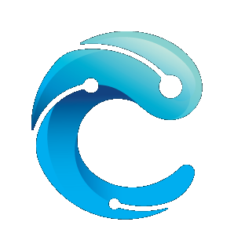

<p align="center">
  
</p>

<h1 align="center">Crest</h1>

<p align="center"><strong>Agent-native development workspace, without losing control.</strong></p>

<p align="center">
  <a href="./README.md">English</a> ·
  <a href="./README.zh-CN.md">简体中文</a>
</p>

<p align="center">
  <a href="./LICENSE"></a>
  
  
</p>


Crest is an agent-native development workspace that combines a code editor, terminal, browser, source control, and AI agent into a single desktop application. The agent can read, edit, and run code across your project while you maintain full visibility and control over what changes.

- **Local-first & private** — Bring your own API key. No accounts, no cloud sync, no telemetry. Sessions and credentials stay on your machine.
- **Project-scoped** — Each workspace is anchored to a directory. Files, terminals, git state, and agent sessions are all scoped to that project.
- **Persistent sessions** — Agent conversations survive restarts. Resume any session and pick up exactly where you left off.
- **In-tree agent runtime** — Built on Pi adapted in-tree (`earendil-works/pi v0.75.5`), providing stateful turn loops, tool execution, queues, and compaction.

> [!IMPORTANT]
> Crest is an unreleased POC/MVP. APIs and product behavior are still evolving.

## Features

### Agent Sessions

- Persistent, resumable agent conversations scoped to each project
- Built-in tools: `read`, `write`, `edit`, `ls`, `bash`, `find`, `grep`, `web_fetch`
- Slash commands for session management (`/new`, `/fork`, `/clone`, `/tree`, `/model`)
- Model selection supporting OpenAI, Anthropic, Google Gemini, MiniMax, and OpenRouter
- Live streaming of agent thoughts, text output, and tool calls

### Code Editor & File Explorer

- Project file tree with directory navigation
- Syntax-highlighted code editor
- Multi-tab interface for switching between files
- File operations (create, rename, delete) integrated with the workspace

### Terminal

- Built-in terminal emulator with PTY support
- Multi-tab terminal sessions
- Command output visible and inspectable at all times
- Shell integration for working directory tracking

### AI Code Review

- Side-by-side diff view of agent-proposed changes
- Changed files list with add/delete line counts
- Review changes before accepting them into your project

### Source Control

- Commit graph visualization
- Branch and commit history
- Uncommitted changes panel
- Author, date, and change stats per commit

### Embedded Browser

- Built-in browser for web research and documentation
- Preview local dev servers without leaving the workspace
- Multi-tab browsing with standard navigation controls

## Screenshots

### Agent Sessions & AI Chat


Keep agent work, tool calls, progress, and project context together in a persistent session.

### Code Editor & File Explorer


Navigate the repository and inspect or edit code without leaving the active workspace.

### Resume Sessions


Return to earlier agent sessions and continue with their conversation history intact.

### Code Review


Review changes as a focused diff before deciding what belongs in the project.

### Source Control


Inspect branches, commits, and repository state from the workspace.

### Embedded Browser


Browse the web and preview local dev servers without leaving the workspace.

## Quick Start

### Prerequisites

- Node.js >= 22.12
- npm 10.9.2
- Go 1.25.6
- [Task](https://taskfile.dev/)

### Run from Source

```bash
git clone https://github.com/Jason-Shen2/crest.git
cd crest
npm install
task dev
```

`task dev` is the preferred entry point — it builds the Go backend and scaffolds before starting Electron/Vite.

### Configure an AI Provider

Crest uses a bring-your-own-key model. On first run, create `~/.config/crest-dev/ai.json` (packaged release uses `~/.config/crest/ai.json`):

```json
{
    "providers": {
        "openai": {
            "token": "YOUR_API_KEY"
        }
    },
    "default": {
        "provider": "openai",
        "model": "gpt-4.1"
    }
}
```

Supported providers: OpenAI, Anthropic, Google Gemini, MiniMax, MiniMax-CN, OpenRouter.

## Agent Harness Architecture

Crest runs the agent loop in Electron main so credentials, tool execution, and session ownership stay outside the renderer while the UI remains a live, inspectable mirror.


Pi supplies the stateful `AgentHarness`: AI provider abstractions, typed event streams, steering queues, hooks, tool-loop mechanics, compaction, and session primitives. Crest supplies the desktop integration: assistant-ui bridge, structured preload/IPC APIs, project context assembly, Crest-specific tools, and SQLite-backed session persistence.

For deeper details see the [Agent User Guide](./docs/agent-user-guide.md) and [Agent architecture docs](./docs/agent-architecture.md).

## Tech Stack

| Layer | Technology |
| --- | --- |
| Frontend | React, TypeScript, Tailwind CSS, assistant-ui, Jotai |
| Desktop | Electron (main process + renderer) |
| Backend | Go (wavesrv), SQLite, WPS events, wsh RPC |
| Agent Runtime | Pi v0.75.5 (adapted in-tree) |
| Build | Vite, Task, esbuild |

## Development

| Command | Purpose |
| --- | --- |
| `task dev` | Full development workflow: Go build + Electron/Vite |
| `npm run dev` | Start Electron/Vite only (backend must already be built) |
| `npm run build:dev` | Build Electron app in development mode |
| `npm run build:prod` | Build Electron app in production mode |
| `npm run test` | Run Vitest test suite |

## Roadmap

- [ ] MCP (Model Context Protocol) tool support
- [ ] Browser automation for agent workflows
- [ ] Interactive per-tool approval UI
- [ ] Remote development via `wsh`
- [ ] Richer agent session organization and search
- [ ] Keychain-backed credential storage

## Origin & Acknowledgements

Crest began as a fork of [Wave Terminal](https://github.com/wavetermdev/waveterm) and draws inspiration from:

- **TRAE** — AI-assisted engineering workflow exploration
- **Warp** — AI-native terminal interaction and inspectable tool execution
- **Terax** — Agent-first interface patterns and review workflows
- **Pi** — In-tree adapted agent runtime

See [NOTICES.md](./NOTICES.md) for third-party attributions.

## License

[Apache License 2.0](./LICENSE)
