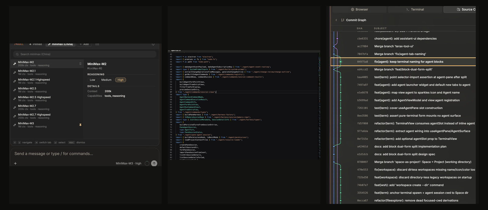
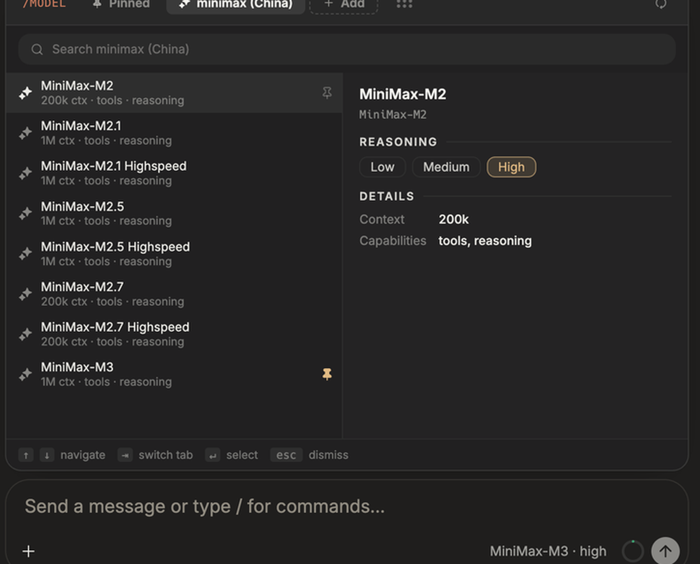
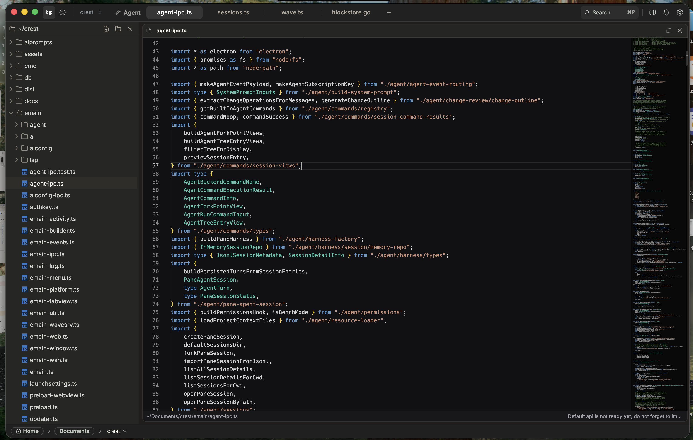
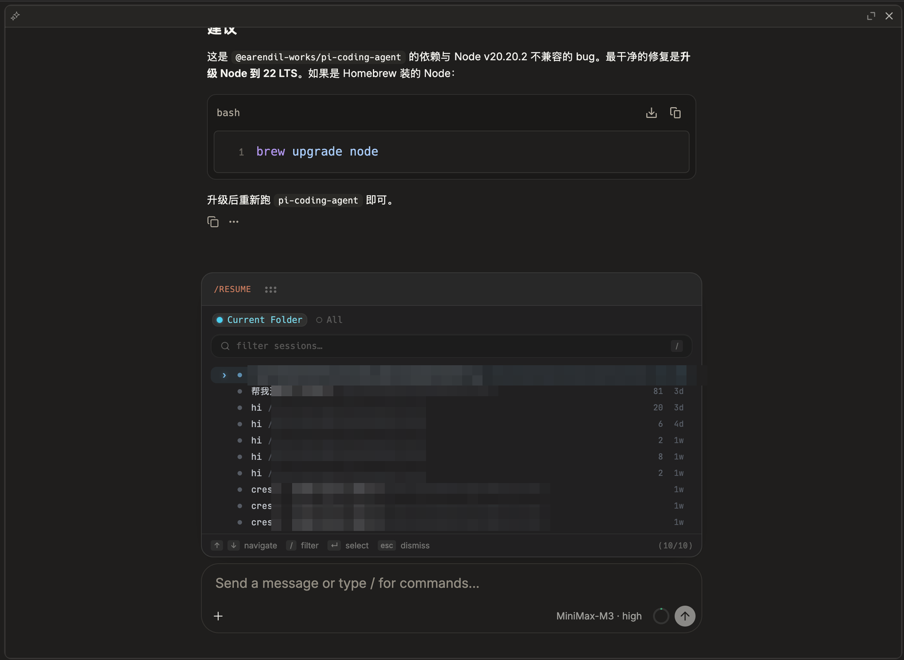
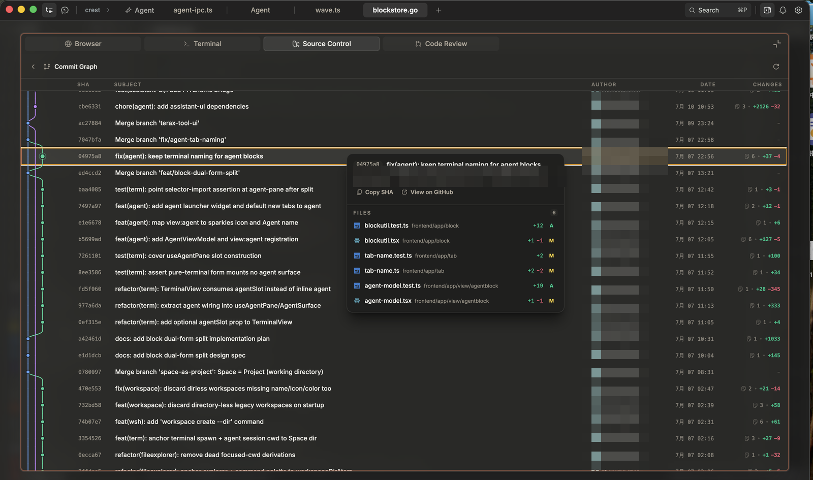
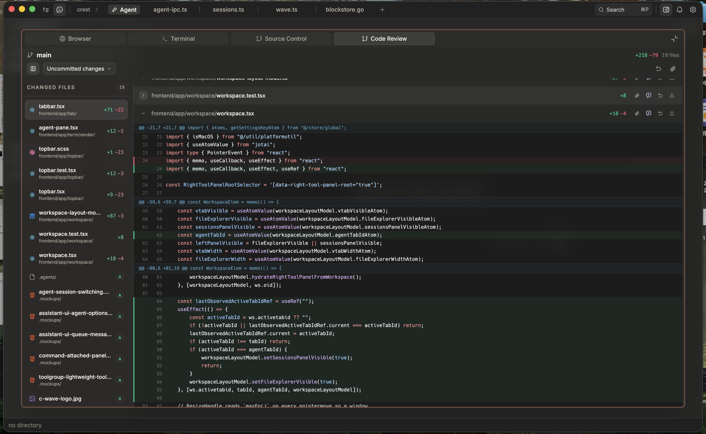
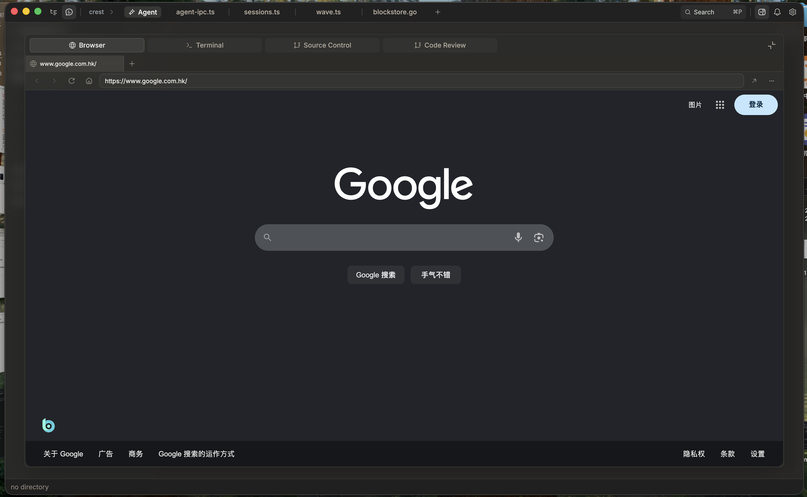

<h1 align="center">Crest</h1>

<p align="center"><strong>Agent-native development, without losing control.</strong></p>

<p align="center">
  <a href="./README.md">English</a> ·
  <a href="./README.zh-CN.md">简体中文</a>
</p>

<p align="center">
  <a href="./LICENSE"></a>
  
  
</p>



> [!IMPORTANT]
> Crest is an unreleased POC/MVP. APIs, product behavior, and internal names are still evolving, and some Wave/WaveTerm legacy naming remains.

## Why Crest

Coding agents can now inspect, edit, run, and validate meaningful parts of a software project, but the surrounding tools still tend toward one of two extremes. Editor-first IDEs confine the agent to a sidebar and leave developers to shuttle context between files, terminals, browsers, and chat. Agent-only tools move faster, but often make it harder to inspect local state, intervene precisely, or review what changed.

Crest explores the middle ground: an agent-first development workspace where execution remains visible, interruptible, and reviewable. The Agent can work across the project while the developer keeps control of context, risk, and final decisions.

## Product Principles

1. **One Space = One Project.** Each Space is anchored to one working directory, keeping files, terminals, previews, Git state, and Agent Sessions scoped to the project that owns them.
2. **Agent-first workflow.** The Agent can gather context, edit files, run commands, use tools, and report results without forcing the developer to assemble the workflow across separate applications.
3. **Human-in-the-loop control.** Crest keeps tool activity, command output, and diffs visible so developers can redirect work, inspect risk, and decide what to accept.
4. **Focused workspace.** File Tree and Session History provide navigation in the left panel, while Editor, Browser, Terminal, Code Review, and Source Control share the tabbed Right Panel. The Browser supports web research and can also open a local app URL, while the full toolset stays available with only one active tool surface competing for attention.
5. **Review-centered development.** The core loop is discuss, execute, validate, and review, rather than treating generated code as the end of the task.

## Product Tour

### Project-scoped Agent Sessions



Keep Agent work, tool calls, progress, and project context together in a persistent session.

### File Tree and Code Editor



Navigate the repository and inspect or edit code without leaving the active workspace.

### Resume Sessions in Context



Return to earlier Agent Sessions from the current project and continue with their conversation history intact.

### Source Control



Inspect branches, commits, and repository state from the shared Right Panel.

### Code Review



Review changes as a focused diff before deciding what belongs in the project.

### Built-in Browser



Browse the web and consult documentation without leaving the workspace. The Browser can also open a local app URL when you need to inspect a running project.

## What Works Today

Available now:

- Project-scoped Spaces.
- Persisted, resumable Agent Sessions and timelines.
- Terminal, File Tree, editor, Browser, Source Control, Preview, and Code Review surfaces.
- Model selection and slash commands.
- Registered Agent tools for reading, writing, and editing files, listing directories, running shell commands, finding files, searching text, and fetching web content (`read`, `write`, `edit`, `ls`, `bash`, `find`, `grep`, and `web_fetch`).
- Diff viewing and command review surfaces.

> [!WARNING]
> Fine-grained interactive tool approval is still incomplete. In the current v1 flow, tools may be allowed when no explicit allowlist is supplied. Run Crest only in environments where you understand and accept that risk.

## Quick Start

### Prerequisites

- Node.js >= 22.12
- npm 10.9.2
- Go 1.25.6
- [Task](https://taskfile.dev/)

### Run from Source

```bash
git clone https://github.com/Jason-Shen2/crest.git
cd crest
npm install
task dev
```

`task dev` is the preferred full-app entry point because it prepares the Go backend and required scaffold before starting Electron/Vite. Use `npm run dev` only when those dependencies are already prepared and you need the Electron/Vite development process by itself.

## Configure an AI Provider

Crest uses a bring-your-own-key model. When started with `task dev`, it reads provider credentials and the default model selection from `~/.config/crest-dev/ai.json`; a packaged release reads `~/.config/crest/ai.json`. Set `WAVETERM_CONFIG_HOME` to override the config home in either environment, in which case Crest reads `$WAVETERM_CONFIG_HOME/ai.json`. A valid configuration is required before the Agent can send a message.

```json
{
    "providers": {
        "openai": {
            "token": "YOUR_API_KEY"
        }
    },
    "default": {
        "provider": "openai",
        "model": "gpt-4.1"
    }
}
```

The shipped provider catalog covers OpenAI, Anthropic, Google Gemini, and OpenRouter. The inline `token` form above is convenient for a first run but stores the key as plaintext; see the [Agent User Guide](./docs/agent-user-guide.md) for keychain-backed `tokensecretname` credentials, profiles, custom models, and custom endpoints.

## Agent Harness Architecture

Crest moved the Agent loop into Electron main so local provider credentials, tool execution, session ownership, and desktop integration stay outside the renderer while the UI remains a live, inspectable mirror. The runtime is built on Pi adapted in-tree from `earendil-works/pi v0.75.5`; Crest does not consume Pi as published npm packages or reuse the Pi CLI/TUI wholesale.


Pi supplies the stateful `AgentHarness`, AI provider abstractions, typed event stream, steering and follow-up queues, hooks, tool-loop mechanics, compaction, and session primitives. Crest supplies the desktop integration around it: the assistant-ui bridge, `usePiChat`, structured preload/IPC APIs, `PaneAgentSession`, project-context assembly, Crest-specific tools, and SQLite-backed session persistence.

The boundary is intentional:

| Layer | Owned by | Responsibility |
| --- | --- | --- |
| Agent Workspace UI | Crest | Renders the thread, composer, tool state, diffs, and project surfaces without becoming the source of truth. |
| Session owner + IPC | Crest | Routes one `agent:event` stream per session path and owns authoritative messages, turns, queues, and status through `PaneAgentSession`. |
| Agent Harness | Pi adapted in-tree | Runs the stateful turn loop, streams typed events, gates hooks, manages queues, invokes tools, and compacts context. |
| Runtime foundations | Crest + Pi | Pi streams through provider abstractions; Crest binds project tools and persists sessions as SQLite-backed `.db` files. |

One Agent Turn follows five stages: Crest assembles cwd, project instructions, skills, history, and active tools into context; Pi streams model thinking, text, and structured Tool Calls; Crest validates and executes the requested tools through the permission boundary; the session appends durable events to the SQLite `.db` carrier; then the UI reflects the live event stream and can later rebuild the same timeline from persistence. Tool results re-enter context until the Harness settles the turn. JSONL remains available for session import/export, but it is an interchange format rather than the on-disk carrier.

This design keeps Agent work inspectable, project-scoped, resumable after restart, and compatible with Human-in-the-loop control: the renderer shows what happened, Electron main owns what is happening, and persisted session state carries what can be resumed.

## Architecture

Crest is a desktop application split across the renderer, Electron main, and a local Go backend. The renderer owns the workspace UI, Electron main owns desktop integration and Agent Runtime orchestration, and the Go process owns terminal control, workspace persistence, RPC, events, and remote-session infrastructure. For deeper implementation details, see the [project code wiki](./docs/code-wiki/README.md), [Agent architecture](./docs/agent-architecture.md), and [Agent runtime architecture](./docs/agent-runtime-architecture.md).

| Path | Direction | Purpose |
| --- | --- | --- |
| React renderer | UI surface | File Tree, Editor, Browser, Terminal, Source Control, Code Review, Agent thread, and review surfaces. |
| Electron preload/IPC | Renderer to Electron main | Desktop APIs, Agent Session operations, live `agent:event` streaming, model/provider access, and tool orchestration. |
| Electron main | Control plane | Runs the Agent Runtime, protects provider credentials from the renderer, launches the Go backend, and coordinates desktop capabilities. |
| `wshrpc` WebSocket | Renderer to Go backend | Structured RPC for workspace, block, terminal, connection, and service operations. |
| `/wave/service` HTTP | Renderer to Go backend | HTTP service path for legacy Wave/WaveTerm backend operations. |
| Go backend (`wavesrv`) | Local backend | Terminal controllers, WPS events, SQLite-backed workspace data, remote sessions, config, and services. |

| Path | Responsibility |
| --- | --- |
| `frontend/` | React and TypeScript renderer, workspace UI, state, and product surfaces. |
| `emain/` | Electron main process, preload APIs, IPC, AI providers, and Agent runtime. |
| `pkg/` | Go libraries for storage, RPC, terminal control, events, connections, config, and services. |
| `cmd/wsh/` | `wsh` CLI entry point and command implementations. |
| `cmd/server/` | Local Go backend entry point, still named `wavesrv` in legacy code. |
| `db/` | Embedded SQLite migrations. |
| `docs/` | Architecture, product, runtime, and implementation documentation. |
| `schema/` | Configuration schemas copied into application builds. |

## Development

| Command | Purpose |
| --- | --- |
| `task dev` | Run the full development workflow: install dependencies, build the Go backend and scaffold, then start Electron/Vite. |
| `npm run dev` | Start Electron/Vite only. |
| `npm run start` | Preview an already built application. |
| `npm run build:dev` | Build the Electron application in development mode. |
| `npm run build:prod` | Build the Electron application in production mode. |
| `npm run test` | Run the Vitest test suite. |

## Status and Roadmap

Crest is an unreleased POC/MVP, not a stable distribution. APIs and product behavior may change, some Wave/WaveTerm names still remain, AI features require a valid local provider configuration, and fine-grained interactive approval is still being completed.

Current directions, not release promises:

- Stronger Agent Session creation, organization, and recovery.
- Complete command, diff, and Review workflows.
- Richer project-context organization.
- Remote development workflows.
- Browser automation for Agent workflows.
- MCP-based Agent tool execution.
- Clearer boundaries between automation, approval, and review.

## Origin and Acknowledgements

Crest began as a fork of [Wave Terminal](https://github.com/wavetermdev/waveterm) and retains parts of its terminal engine, Go backend, `wsh` tooling, and workspace architecture. Its Agent-native direction also draws on:

- **TRAE** for product exploration and an AI-assisted engineering workflow.
- **Warp** for AI-native terminal interaction, blocks, and inspectable tool execution.
- **Terax** for Agent-first interface patterns and Source Control and review workflows.
- **Pi** for the in-tree adapted Agent runtime, AI provider abstractions, and selected coding-agent behavior.

See [NOTICES.md](./NOTICES.md) for third-party attributions and license notices.

## License

Crest is licensed under the [Apache License 2.0](./LICENSE).
